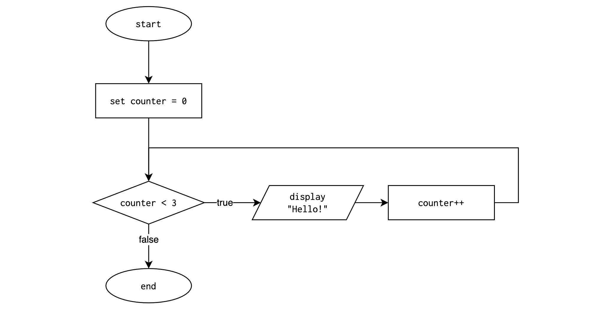
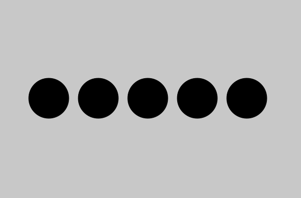

# Lesson: `For` Loops

**Previous Lesson:** [If Statements](https://github.com/SACHSTech/Lesson-If-Statements)

## Why Loops?

Programs often need to **repeat** actions. For example, printing a sequence, calculating totals, checking multiple inputs — all involve doing the same thing multiple times.

Copy-pasting code works, but it’s inefficient, error-prone, and inflexible:

```java
System.out.println("Hello!");
System.out.println("Hello!");
System.out.println("Hello!");
```

If you wanted to print “Hello!” 100 times, this wouldn’t be realistic. That’s where **loops** come in.

<br>

## What is a `For` Loop?

A **`for` loop** repeats a block of code a *specific* number of times:

```java
for (int counter = 0; counter < 3; counter++) {
    System.out.println("Hello!");
}
```

**Output:**
```
Hello!
Hello!
Hello!
```

This loop runs **3 times**, because:
1. `counter` variable is initialized and starts at 0.  
2. The loop continues **while** `counter < 3`.  
3. After each repetition, `counter++` increases `counter` by 1.


### Visualizing the Flow



<br>

## `For` Loop Structure

| Part | Description | Example |
|------|--------------|----------|
| **Initialization** | Create and start counter | `int i = 0` |
| **Condition** | Continue while this is true | `i < 5` |
| **Update** | Change the counter after each run | `i++` |

```java
for (int i = 0; i < 5; i++) {
    System.out.println("i = " + i);
}
```

**Output:**
```
i = 0
i = 1
i = 2
i = 3
i = 4
```
<br>

## What is a `For` Loop?
There are many uses for loops, especially when combined with variables and nested conditionals. Here are some examples.

### Example 1: Counting Up

```java
for (int num = 1; num <= 10; num++) {
    System.out.println(num);
}
```

Prints 1 to 10. But what would happen if we changed the condition to `num < 10`?


### Example 2: Counting Down

```java
for (int num = 10; num >= 1; num--) {
    System.out.println(num);
}

System.out.println("Blastoff!");
```

Counts down before printing `Blastoff!`. Note how the code must complete the loop execution before moving on with the program.

### Example 3: Using Variables in Loops

You can use the counter inside the loop to drive math or text.

```java
for (int i = 1; i <= 5; i++) {
    System.out.println("Square of " + i + " is " + (i * i));
}
```

**Output:**
```
Square of 1 is 1
Square of 2 is 4
Square of 3 is 9
Square of 4 is 16
Square of 5 is 25
```

### Example 4: Use in Drawing

Repetition isn’t just for math — it can also be used for graphics. Using the Processing library, we can draw 5 circles across the screen, evenly spaced:

```java
for (int x = 50; x <= 250; x += 50) {
    ellipse(x, 100, 40, 40);  // Draw a circle
}
```

This results in:




### Example 5: Summing User Input

Now let’s include interaction:

```java
public class SumInputs extends ConsoleProgram {
    public void run() {
        int count = readInt("How many numbers? ");
        int total = 0;

        for (int i = 0; i < count; i++) {
            int value = readInt("Enter a number: ");
            total = total + value;
        }

        System.out.println("Total = " + total);
    }
}
```

How would you modify this to output the average (arithmetic mean) in addition to the total?

### Example 6: Multiplication Table

Loops are useful if you recognize patterns and simplify them.

```java
int num = readInt("Enter a number: ");
for (int i = 1; i <= 10; i++) {
    System.out.println(num + " × " + i + " = " + (num * i));
}
```


### Example 7: Loop with Logic

You can also include conditional statements inside loops.

```java
for (int i = 1; i <= 10; i++) {
    if (i % 2 == 0) {
        System.out.println(i + " is even");
    } else {
        System.out.println(i + " is odd");
    }
}
```


## Common Mistakes

| Error | Code Example | Explanation |
|------|----------|----------|
| **Missing braces** | `for (int i = 0; i < 3; i++) System.out.println(i); System.out.println("Done!");` | Only the **first line** repeats — `"Done!"` prints once, not in the loop. Always use `{}` for clarity. |
| **Uninitialized counter** | `for (i = 0; i < 5; i++)` | Causes a **syntax error** — the loop variable must be declared (`int i = 0;`). |
| **Off-by-one error** | `for (int i = 1; i < 10; i++)` (when you wanted 1–10) | Common logic mistake — loop ends **one short** or **one extra**. Check your condition carefully. |
| **Wrong condition** | `for (int i = 0; i > 10; i++)` | Never runs — the condition is **false at the start**. |
| **Infinite loop** | `for (int i = 0; i >= 0; i++)` | Runs forever — the condition **never becomes false**. |
| **Wrong update direction** | `for (int i = 10; i < 20; i--)` | Logic reversed — the counter moves **away** from the stop condition. |
| **Shadowed variable** | `int i = 0; for (int i = 0; i < 5; i++)` | Declares two `i`s — causes a **compile-time error**. The outer `i` is hidden. |

<br><br>

# Practice Problems

1. **Printing a Pattern of Dashes**  
Ask how long a line to draw and print that many `-` characters.  
_Hint: There's a difference between_ `print()` _and_ `println()` _for output._  
  
    **Example Output:**
    ```
    How long a line? 12
    ------------
    ```

<br>

2. **Counting Coins**  
Ask how many coins you have and print `clink!` that many times.  

    **Example Output:**
    ```
    How many coins do you have? 5
    clink!
    clink!
    clink!
    clink!
    clink!
    ```

<br>

3. **Running Lap Tracker**  
Ask the user for the number of laps to run for a workout. Print `Lap # complete` for each lap, replacing `#` with the lap number. After the loop, print `Workout complete!`.

    **Example Output:**
    ```
    How many laps do you want to run? 3
    Lap 1 complete
    Lap 2 complete
    Lap 3 complete
    Workout complete!
    ```

<br>

4. **Cumulative Distance**  
Assume you run 2 km per day for 14 days. Each day, print the total distance so far.  
_Hint: Try to use an accumulator variable._

    **Example Output:**
    ```
    Day 1 - Total Distance: 2 km
    Day 2 - Total Distance: 4 km
    Day 3 - Total Distance: 6 km
    ...
    Day 14 - Total Distance: 28 km
    ```

<br>

5. **Power of Two Table**  
Print powers of two from `2^1` up to `2^10`.  

    **Example Output:**
    ```
    Power | Result
    ------+-------
    2^1   | 2
    2^2   | 4
    2^3   | 8
    ...
    2^10  | 1024
    ```

<br>

6. **Investment Interest Simulation**  
You invest $1000 for 5 years earning 5% interest compounded annually.  
Print the balance after each year.  

    **Example Output:**
    ```
    Year 1: $1050.00
    Year 2: $1102.50
    Year 3: $1157.63
    Year 4: $1215.51
    Year 5: $1276.28
    ```

<br>

7. **Temperature Warning System**  
Simulate hourly temperature readings for 6 hours using random values between 15–35°C.  
If the temperature is above 30, print `Warning: too hot!` after the reading. 

    **Example Output:**
    ```
    Hour 1: 27°C
    Hour 2: 32°C
    Warning: too hot!
    Hour 3: 25°C
    Hour 4: 34°C
    Warning: too hot!
    Hour 5: 29°C
    Hour 6: 31°C
    Warning: too hot!
    ```

<br>

8. **Divisible by Three Counter**  
Ask the user for a number `n`. Print all numbers from 1 to `n` that are divisible by 3.  
At the end, print how many there were.  
_Hint: Use `%` to test divisibility and a variable to count total valid numbers._

    **Example Output:**
    ```
    Divisible by Three
    ------------------
    Enter a number: 15
    3
    6
    9
    12
    15
    There are 5 numbers divisible by 3.
    ```
<br>

9. **Guessing Game (Challenge)**  
Generate a random number 1–10. Let the user guess up to 3 times.  
If the guess is correct, print `You got it!` and stop.  
Otherwise, give a hint (`too high` or `too low`).

    **Example Output:**
    ```
    I'm thinking of a number between 1 and 10.
    Enter your guess: 4
    Too low!
    Enter your guess: 8
    Too high!
    Enter your guess: 6
    You got it!
    ```
<br>

10. **Pattern Builder (Challenge)**  
Ask the user for a number of rows, `r`. Print `r` rows forming a **right-aligned** triangle of stars.

    **Example Output:**
    ```
    How many rows? 5

        *
       **
      ***
     ****
    *****
    ```
<br>

# Summary

- Loops automate **repetition** and reduce duplication.  
- `for` loops use a counter variable to control execution.  
- Initialization → Condition → Update → Repeat.  
- You can nest logic (`if` statements) *inside* loops.  
- Common use cases: counting, summing, accumulating, table generation.
